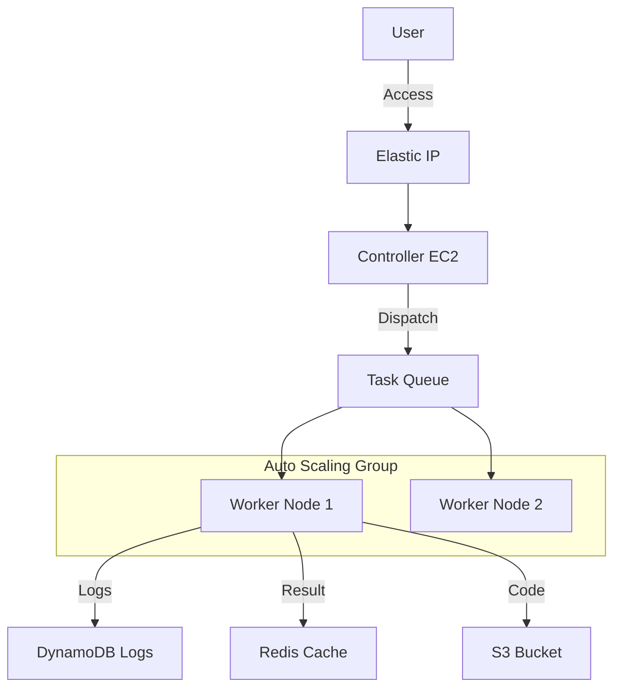

# ☁️ Infra: FaaS Platform Terraform Modules

<div align="center">


**Automated AWS Infrastructure Modules for FaaS Platform**

</div>

---

## 📖 Introduction

This project defines all necessary AWS resources for the FaaS platform using Terraform (IaC), supporting **One-Click Deployment**.
It includes the full stack from VPC networking to EC2 instances, Auto Scaling Groups (ASG), Load Balancers, and data stores (DynamoDB, S3).

---

## 🏗️ Architecture



### 📦 Managed Resources
- **Compute**:
  - `Controller`: Central node with a static Elastic IP (EIP).
  - `Worker ASG`: Auto-scaling execution node group based on Launch Templates.
- **Networking**:
  - `VPC`: Utilizes default VPC and public subnets for simplicity.
  - `Security Groups`: Controls traffic for internal communication (Ports 8080, 6379, 22).
- **Storage & DB**:
  - `DynamoDB`: Stores metadata (`InfraFunctions`) and execution logs (`InfraExecutionLogs`) with TTL.
  - `S3`: Stores user code artifacts (`code-bucket`) and execution outputs (`output-bucket`).
  - `ElastiCache`: Redis for real-time status sharing and Pub/Sub.
- **Messaging**:
  - `SQS`: Task queue for asynchronous job processing.

---

## 🚀 Deployment Guide

### Prerequisites
- Terraform v1.0+
- AWS CLI configured with credentials (`aws configure`)

### 1. Initialize
```bash
terraform init
```

### 2. Configure Variables (Optional)
Create a `terraform.tfvars` file to override defaults.
```hcl
project_name          = "my-faas"
aws_region            = "ap-northeast-2"
warm_pool_python_size = 10  # Number of pre-warmed Python containers
```

### 3. Apply Resources
```bash
terraform apply
```

### 4. Check Outputs
Note the output values after deployment.
```bash
# SSH into Controller
ssh -i faas-key-v2.pem ec2-user@<controller_elastic_ip>

# Redis Endpoint
<redis_endpoint>
```

---

## ⚙️ Key Variables

| Variable | Description | Default |
|----------|-------------|---------|
| `aws_region` | AWS Region to deploy resources | `ap-northeast-2` |
| `project_name` | Resource name prefix | `faas` |
| `warm_pool_python_size` | Number of warm Python containers per worker | `5` |
| `instance_type` | EC2 Instance Type | `t3.micro` |

---

## ⚠️ Notes
- **Cost**: AWS resources will incur costs. Use `terraform destroy` when finished.
- **Key Pair**: The `faas-key-v2.pem` file is generated locally. Keep it secure.
- **Cleanup**: Run `terraform destroy` to remove all resources.
